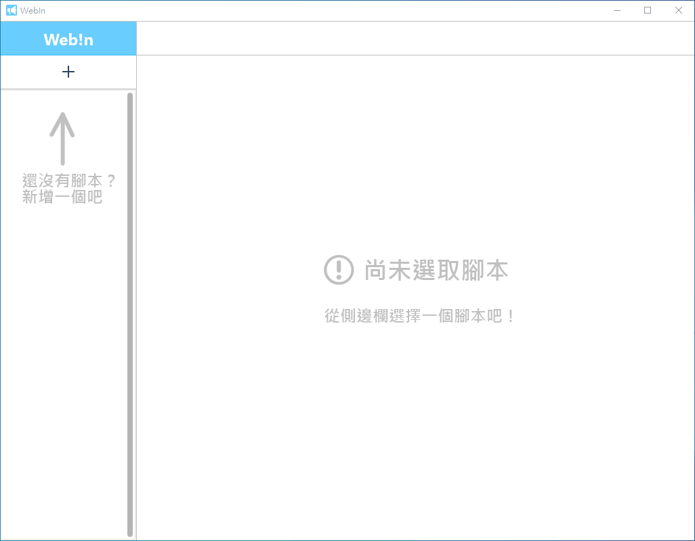
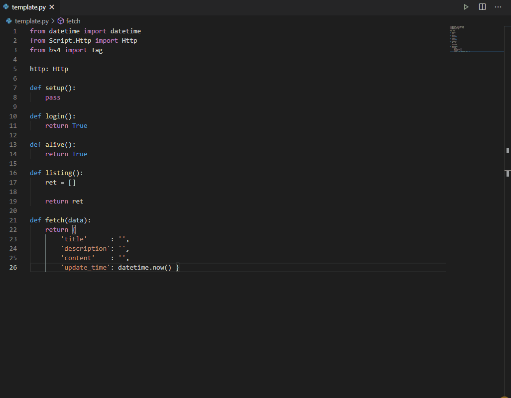
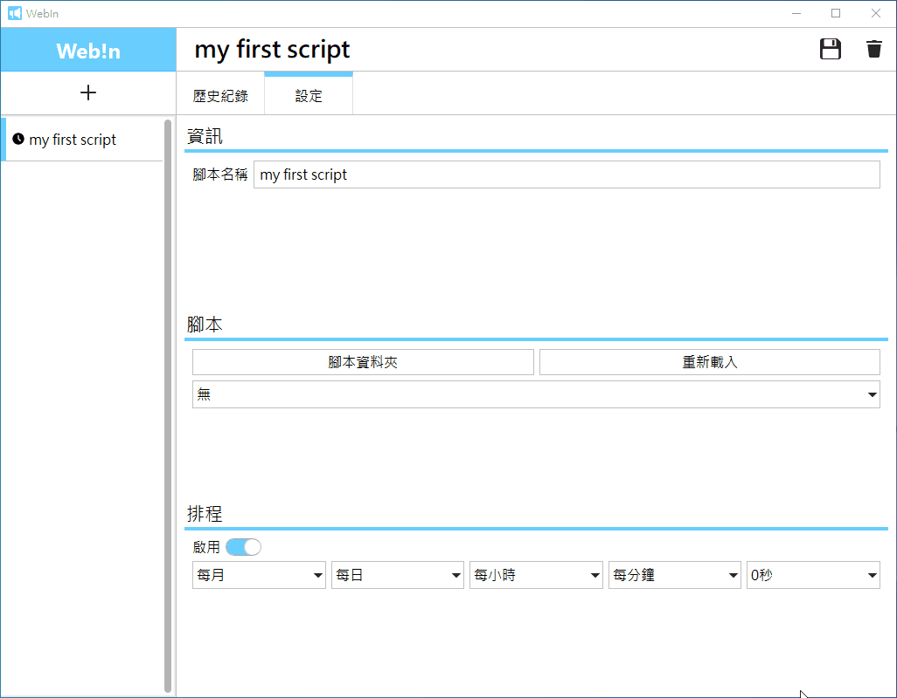
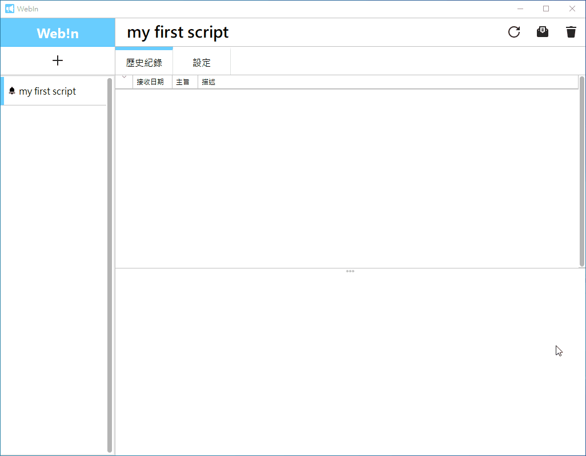

# WebIN

這是一個可以透過爬蟲腳本，爬取各種訊息的通知程式
爬取的通知都會顯示在桌面右下角
並儲存已接收的訊息，方便日後查看


## 使用方式

1. 建立腳本：
   

2. 編寫腳本：
   

3. 設置腳本：
   
4. 執行：
   
   


## 如何建置

1. 安裝 [python 3.7](https://www.python.org/downloads/) 
2. `pip install -r requirements.txt`
3. Windows： `build.bat`

   Linux ： build.sh


## 系統需求

* Windows 7 / Windows 8.1 / Windows 10


## 開發環境

* Python 3.7
* Qt 5


## 套件依賴

* shiboken2==5.15.2
* beautifulsoup4==4.9.3
* pyinstaller==4.2
* PySide2==5.15.2
* requests==2.22.0


## 如何撰寫腳本

爬蟲部份可參考：

* [requests](https://docs.python-requests.org/en/master/)
* [BeautifulSoup4](https://www.crummy.com/software/BeautifulSoup/bs4/doc/)

腳本其餘內容可參考以下內容：

* 腳本架構
* 腳本 API


## 如何擴充 python 套件

1. 進入專案或程式的資料夾
2. 執行 `pip install -e extensions <套件>`

> 注意：目前 pip 不支援 local 資料夾的套件移除，只能手動移除套件

預設擴充套件：

* pycryptodome 3.10.1


## 腳本架構

```python
# 預設含有 session 的物件，可發送 HTTP Request
http: Script.Http.Http

def setup() -> None: 
    ''' 
    [可選] 初始化腳本 
    '''
  
def login() -> bool: 
  	''' 
  	[可選] 登入動作 
    某些網頁會需要登入，在這裡撰寫你的登入程式

    回傳:
        bool 登入是否成功

    注意:
        登入的資訊會被存在 session 中
  	'''  

def alive() -> bool: 
  	''' 
  	[可選] 保持登入 
    某些網頁可能會在幾分鐘內沒動作，在這裡進行動作以維持登入

    回傳:
        bool 是否為登入狀態
  	'''

def listing() -> list:
    '''
    列出爬取目標
    在這裡列出要爬取的資料，並傳遞給 fetch
    也可以在這個階段就先爬取資訊內容

    輸出:
        list [
            dict {
    	        'key' : str  用來識別通知的鍵值，不可重複
                'data': dict 將目前爬取到的資料傳到 fetch 階段
            }
        ]

    注意:
        一定要回傳 list，即使是空的也行
    '''

def fetch(data) -> dict:
    '''
    爬取資訊內容
    接收來自 listing 傳遞的資料，個別取得內容
    這個階段輸出後會直接推送訊息

    輸入:
        data: dict 由 listing 階段送來的資料

    輸出: 
        dict {
            'title'      : str      訊息標題。越短越好
            'description': str      訊息描述。簡單描述訊息
            'content'    : str      訊息內容。
            'update_time': datetime 更新時間。
        }

    注意:
        update_time 的型別一定是 datetime，請不要輸入字串
    '''
```


## 腳本 API

### class Script.Http.Http

#### Property

* Session: requests.Session
  取得目前所使用的 Session

#### Function

* UpdateHeader(self) -> None
  更新目前 Session 裡的 Header

* SetDefaultHost(self, host) -> None
  設定默認的網域

  設定後會可以在發送 Request 時省略網域名稱

  例如：

  ```python
  def setup():
      http.SetDefaultHost('https://www.google.com')
  
  def listing():
      return [{ }]
  
  def fetch(data):
      page = http.Get('/search', { 'q'=123 })
      return {
          'title'      : 'GoogleSearch',
          'description': 'Result of "123"',
          'content'    : str(page),
          'update_time': datetime.now()
      }
  ```

  若使用的網址為 http 開頭，則可無視默認網域發送 Request

* Get (self, url: str, params: dict=None) -> HttpResponse
  發送 HTTP GET Request

  參數：

  * url：要發送 Request 的網址
  * params：GET 參數

  回傳： HttpResponse

* Post (self, url: str, data: dict=None, asjson: bool=False, params: dict=None) -> HttpResponse
  發送 HTTP POST Request

  參數：

  * url：要發送 Request 的網址
  * data：POST 參數
  * asjson：以 Json 的形式傳遞 Post 參數
  * params：GET 參數

  回傳： HttpResponse

* Delete (self, url: str, params: dict=None) -> HttpResponse
  發送 HTTP DELETE Request，與 GET 相似

  參數：

  * url：要發送 Request 的網址
  * params：GET 參數

  回傳： HttpResponse

* Put (self, url: str, data: dict=None, asjson: bool=False, params: dict=None) -> HttpResponse
  發送 HTTP PUT Request，與 POST 相似

  參數：

  * url：要發送 Request 的網址
  * data：POST 參數
  * asjson：以 Json 的形式傳遞 Post 參數
  * params：GET 參數

  回傳： HttpResponse

### class Script.Http.HttpResponse

#### Property

* Status: int
  本次 Http Request 的狀態
* Content
  回傳的資料，有可能是文字，也有可能是 bytes
* Raw: Response
  原始的 requests.Response

#### Function

* ToSoup(self) -> bs4.BeautifulSoup
  將回傳的資料丟入 BeautifulSoup 進行 HTML 解析
  並回傳 BeautifulSoup 實體
* ToDict(self) -> dict
  將回傳的 Json 資料轉為 dict 型態